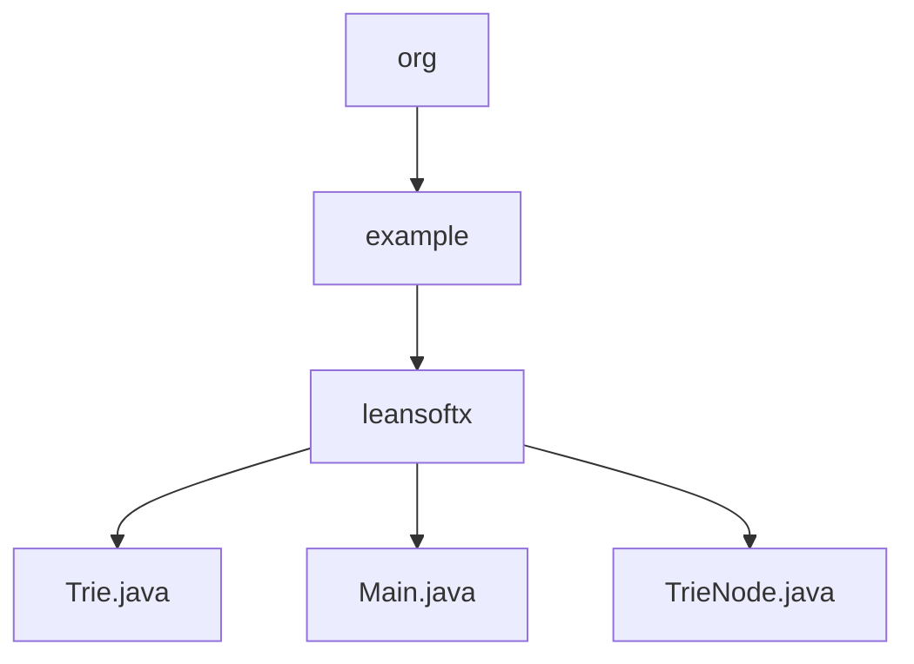

# Basic Information

|      |      |
|------|------|
| Name | org |
| Language | .java |
| Code Path | auto-suggest-java-demo/src/main/java/org |
| Package Name | docs.src.main.java.org |
| Brief Description | The dictionary tree implementation includes functionalities for insertion, search, prefix completion, deletion, and spelling suggestions. The TrieNode class manages characters, child nodes, and word-end markers. The main program provides an interactive command-line interface supporting multiple operation modes, including Tab key completion and edit distance suggestions. |

# Description

## Overview  
This module implements a Trie-based intelligent dictionary system, with core responsibilities including efficient vocabulary storage, prefix-based auto-completion, and spelling suggestion functionalities. The interface specification covers standard Trie operations (insert/search/delete) and extended features (auto-completion/spelling suggestions), similar to the predictive text function in input methods. The key data structure is TrieNode, which contains a character value, a hash map of child nodes, and an end-of-word marker. External dependencies require only a basic Java environment. For example, spelling correction is achieved using the edit distance algorithm, while tree-format printing visualizes the storage structure.  

## Key Business Scenarios  
The system supports interactive dictionary management, with a typical workflow as follows: during initialization, a preset vocabulary is loaded to construct the Trie tree, and users perform search/completion/deletion operations via the command line. The interactive mode includes Tab-triggered prefix completion (similar to IDE code hints) and Backspace-based input modification controls. The complete functional chain includes: real-time candidate word matching when entering prefixes, recommending similar words for misspellings (e.g., suggesting "hello" for "helo"), and dynamically maintaining the Trie structure. API types encompass CRUD operations and query suggestions, with integrated case studies demonstrating the end-to-end process from tree construction to interactive retrieval.

### Package Internal Structure View

This flowchart illustrates the hierarchical structure of a Java project, starting from the org package and progressively expanding to the leansoftx subpackage under the example package. It ultimately displays the three Java files contained within this subpackage: Trie.java, Main.java, and TrieNode.java. The entire structure clearly presents the complete path relationship from the top-level package down to the underlying implementation files.

# File List

| Name   | Type  | Description |
|-------|------|-------------|
| [example](example/_module.md) | package | The dictionary tree implementation includes insertion, search, prefix completion, deletion, and spelling suggestion functionalities. The TrieNode class manages characters, child nodes, and word-end markers. The main program provides an interactive command-line interface supporting multiple operation modes, including Tab key completion and edit distance suggestions. |

