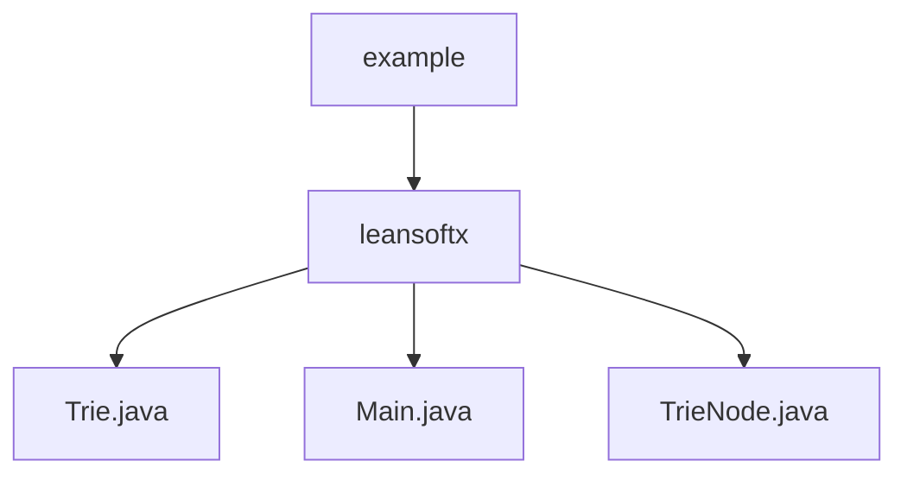

# Basic Information

|      |      |
|------|------|
| Name | example |
| Language | .java |
| Code Path | auto-suggest-java-demo/src/main/java/org/example |
| Package Name | docs.src.main.java.org.example |
| Brief Description | The dictionary tree implementation includes insertion, search, prefix completion, deletion, and spelling suggestion functionalities. The TrieNode class manages characters, child nodes, and word-end markers. The main program provides an interactive command-line interface supporting multiple operation modes, including Tab key completion and edit distance suggestions. |

# Description

## Overview  
This module implements an intelligent dictionary system based on a Trie data structure, with core responsibilities including efficient vocabulary storage, prefix-based auto-completion, and spelling suggestion functionalities. The interface specification covers standard Trie operations (insert/search/delete) and extended features (auto-completion/spelling suggestions), similar to the predictive text function in input methods. The key data structure is TrieNode, which contains a character value, a hash map of child nodes, and an end-of-word marker. External dependencies require only a basic Java environment. For example, spelling correction is achieved through edit distance algorithms, and the storage structure is visualized via tree-shaped printing.

## Key Business Scenarios  
The system supports interactive dictionary management, with a typical workflow as follows: during initialization, a preset vocabulary is loaded to construct the Trie tree, and users perform search/completion/deletion operations via the command line. The interactive mode includes Tab key-triggered prefix completion (similar to IDE code hints) and Backspace key modifications for input control. The complete functional chain includes: real-time candidate word matching when entering prefixes, recommending similar words for misspellings (e.g., suggesting "hello" for "helo"), and dynamically maintaining the Trie structure. API types encompass CRUD operations and query suggestions, with integrated use cases demonstrating the end-to-end process from tree construction to interactive retrieval.

### Package Internal Structure View

This flowchart illustrates the simple package structure of a Java project, with the root node being the 'example' package containing the 'leansoftx' subpackage. The 'leansoftx' package holds three Java files: Trie.java implements the trie data structure, Main.java contains the main program entry point, and TrieNode.java defines the trie node class. The entire structure clearly reflects the code organization of the autocomplete demonstration project.

# File List

| Name   | Type  | Description |
|-------|------|-------------|
| [leansoftx](leansoftx/_module.md) | package | The dictionary tree implementation includes insertion, search, prefix completion, deletion, and spelling suggestion functionalities. The TrieNode class manages characters, child nodes, and word-end markers. The main program provides an interactive command-line interface supporting multiple operation modes, including Tab key completion and edit distance suggestions. |

