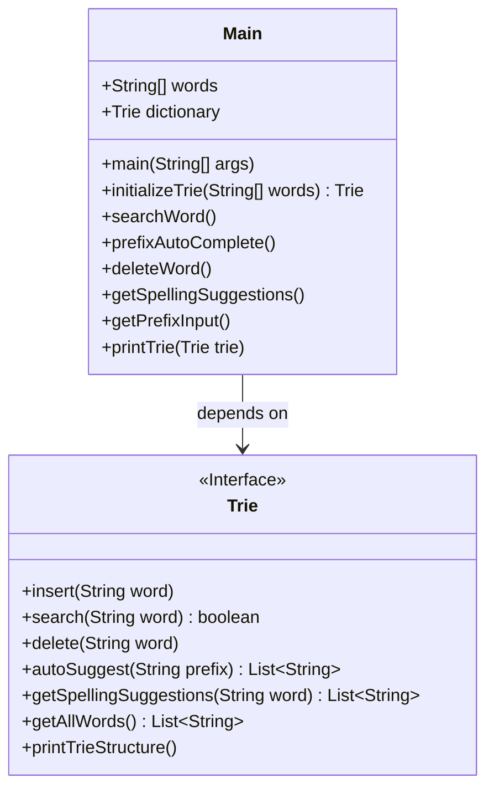
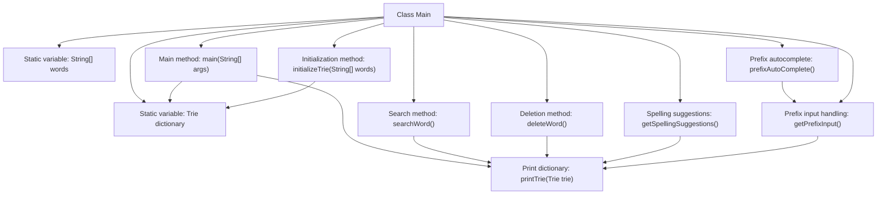

# Basic Information

|      |      |
|------|------|
| Name | Main |
| Language | .java |
| Code Path | auto-suggest-java-demo/src/main/java/org/example/leansoftx/Main.java |
| Package Name | org.example.leansoftx |
| Dependencies | ['java.util.List', 'java.util.Scanner'] |
| Brief Description | The Java class Main implements the Trie functionality, including word search, prefix autocompletion, word deletion, and spelling suggestions. It initializes the Trie and prints its structure, supporting interactive user operations. |

# Description

The code implements a dictionary system based on a Trie tree, including word insertion, search, prefix autocompletion, deletion, and spelling suggestion functionalities. During initialization, it loads a preset word array and constructs the Trie tree, with the main program capable of printing the dictionary structure. It provides an interactive command-line interface supporting four operation modes: displaying word existence during search; prefix autocompletion via Tab key to cycle through matching results; deleting specified words; and obtaining spelling similarity suggestions. The core class Trie does not reveal its specific implementation, but its method names indicate standard Trie operations and additional features like auto-suggestion. Input handling includes interactive control for special characters such as backspace and space.

# Class Summary

| Name   | Type  | Description |
|-------|------|-------------|
| Main | class | Java program implementing a dictionary Trie tree, supporting insertion, search, prefix completion, deletion, and spelling suggestion functionalities. |


## Class Main

|      |      |
|------|------|
| Access Modifier | public |
| Type | class |
| Name | Main |
| Description | Java program implementing a dictionary Trie tree, supporting insertion, search, prefix completion, deletion, and spelling suggestion functionalities. |


### UML Class Diagram



This code demonstrates a dictionary system implemented based on a Trie tree. The Main class serves as the entry point, containing functionalities such as dictionary initialization, word search, prefix auto-completion, word deletion, and spelling suggestions. The Trie interface defines core dictionary operations including insert, search, delete, auto-suggest, and spelling suggestion methods. Through composition with the Trie interface, the Main class implements complete dictionary features, including interactive command-line operations and Trie structure visualization.


### Internal Method Call Graph



This flowchart illustrates the core structure and functional call relationships of the Main class. The class includes static dictionary data initialization, Trie structure printing, and four main functional methods (search/prefix autocomplete/deletion/spelling suggestions), where the prefix autocomplete feature implements interactive input handling through getPrefixInput. All functional methods rely on the printTrie method to display the current dictionary state, and the initializeTrie method constructs the Trie data structure during initialization. The arrows clearly reflect the calling hierarchy and data flow between methods.

### Field List

| Name  | Type  | Description |
|-------|-------|------|
| words = {            "as", "astronaut", "asteroid", "are", "around",            "cat", "cars", "cares", "careful", "carefully",            "for", "follows", "forgot", "from", "front",            "mellow", "mean", "money", "monday", "monster",            "place", "plan", "planet", "planets", "plans",            "the", "their", "they", "there", "towards"    } | String[] | Containing 30 English words grouped alphabetically, covering common vocabulary starting with the letters a, c, f, m, p, t. |
| dictionary = initializeTrie(words) | Trie | Initialize the dictionary Trie, with static variables storing the word collection. |

### Method List

| Name  | Type  | Description |
|-------|-------|------|
| main | void | As a professional translation assistant, please accurately translate the following content into the target language.  Strictly adhere to the following guidelines:  1. Maintain consistency with the original text's semantics, context, and style.  2. Preserve the original hierarchical structure and numbering system in full.  3. Strictly retain all formatting elements of the original text, such as code block identifiers (```text/```, ```mermaid/```), etc.  4. Translate only natural language content, without adjusting formats, adding content, or providing explanatory processing.  5. Output only the translation result of the original text, without any additional prompts.  Content to be translated:  The Java main function calls a dictionary to print the Trie structure, while other functionalities are commented out.  Target language code: en |
| prefixAutoComplete | void | The static method `prefixAutoComplete` displays the trie and retrieves prefix input. |
| deleteWord | void | This method is used to remove words from a dictionary. First, it prints the dictionary contents, then loops to prompt the user for the word to be deleted. If the input is empty, it exits; otherwise, it checks whether the word exists and either deletes it or prompts that it was not found. Finally, it closes the scanner. |
| getSpellingSuggestions | void | This method demonstrates the dictionary spelling suggestion feature: it prints the dictionary tree, receives user input, and returns and displays a list of similar words or a no-suggestion prompt. |
| getPrefixInput | void | Java method implementation for prefix input search functionality, supporting space, backspace, enter, and Tab key for cycling through search results, with exception handling included. |
| initializeTrie | Trie | This method initializes a trie, traverses the input string array and inserts each word into the trie, then returns the constructed trie. |
| searchWord | void | The static method `searchWord` displays dictionary contents and repeatedly prompts the user to enter a word for searching. Exits when empty input is received, and displays a "not found" message if the word is not located. |
| printTrie | void | Print all words in the trie, separated by commas. |


