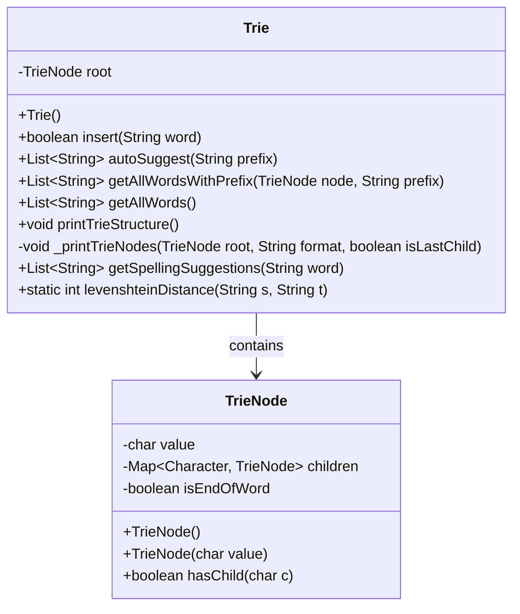
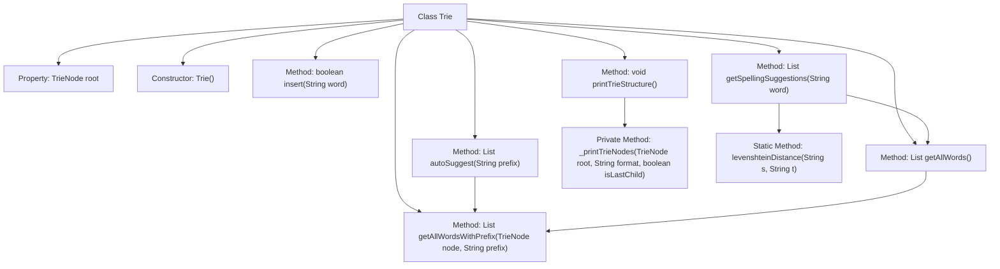

# Basic Information

|      |      |
|------|------|
| Name | Trie |
| Language | .java |
| Code Path | auto-suggest-java-demo/src/main/java/org/example/leansoftx/Trie.java |
| Package Name | org.example.leansoftx |
| Dependencies | ['java.util'] |
| Brief Description | Implementation of a Trie tree supporting word insertion, prefix autocompletion, spelling suggestions (based on edit distance), and tree structure printing. Core operations include node traversal and recursive processing. |

# Description

The code implements a trie data structure, including functionalities such as inserting words, prefix-based autocompletion, retrieving all words, printing the tree structure, and spelling suggestions. The trie stores characters and child nodes through TrieNode objects, using a hash table to manage child node relationships. The insertion method constructs tree paths character by character and marks word endings. The autocompletion feature finds matching words based on prefixes. Spelling suggestions are filtered using an edit distance algorithm. The print method visualizes the trie in a tree-like structure.

# Class Summary

| Name   | Type  | Description |
|-------|------|-------------|
| Trie | class | The Trie class implements a dictionary tree, supporting functions such as word insertion, prefix autocompletion, retrieving all words, printing the tree structure, and spelling suggestions, using Levenshtein distance to calculate similar words. |

## Class Trie

|      |      |
|------|------|
| Access Modifier | public |
| Type | class |
| Name | Trie |
| Description | The Trie class implements a dictionary tree, supporting functions such as word insertion, prefix autocompletion, retrieving all words, printing the tree structure, and spelling suggestions, using Levenshtein distance to calculate similar words. |

### UML Class Diagram

This code implements a Trie (prefix tree) data structure for efficient string storage and retrieval. The Trie class includes functionalities such as inserting words, auto-completion suggestions, retrieving all words, printing the Trie structure, and spelling suggestions. The TrieNode class represents tree nodes, storing character values, child node mappings, and end-of-word flags. The levenshteinDistance method calculates string edit distance for spelling suggestions. This structure is particularly suitable for dictionary implementations and prefix search scenarios.

### Internal Method Call Graph

This code implements a Trie (prefix tree) data structure for efficient string storage and retrieval. Key functionalities include word insertion, auto-completion suggestions, retrieving all words, printing the Trie structure, and spelling suggestions. Core methods include insert() for building the Trie tree, autoSuggest() for prefix matching, and getSpellingSuggestions() which incorporates the Levenshtein distance algorithm for spelling correction. The private method _printTrieNodes() visualizes the Trie in a tree structure, while the static method levenshteinDistance() calculates string similarity. The overall design demonstrates the efficiency of Tries in string processing.

### Field List

| Name  | Type  | Description |
|-------|-------|------|
| root | TrieNode | The private member variable root, of type TrieNode. |

### Method List

| Name  | Type  | Description |
|-------|-------|------|
| printTrieStructure | void | This method is used to print the Trie tree structure, first outputting the root node, then recursively printing all child nodes, using indentation to represent hierarchical relationships. |
| getAllWords | List<String> | Retrieve the list of all words, invoke the method with the prefix parameter to traverse starting from the root node. |
| getSpellingSuggestions | List<String> | Method for Obtaining Word Spelling Suggestions: Match all words based on the initial letter prefix, calculate the edit distance (≤2) from the input word, and return a list of qualified suggestions. |
| getAllWordsWithPrefix | List<String> | The method `getAllWordsWithPrefix` takes a `TrieNode` and a prefix string as input, and returns a list of words matching the prefix. Currently, it returns `null` and needs to be implemented. |
| insert | boolean | This method inserts a word into the trie. It traverses each character, creating child nodes if they do not exist. If the word already exists, it returns false; otherwise, it marks the end of the word and returns true. |
| levenshteinDistance | int | Calculate the edit distance between two strings using dynamic programming and return the minimum number of operations required. |
| autoSuggest | List<String> | The method `autoSuggest` takes a prefix string, traverses the trie to find the matching node. If no match is found, it returns an empty list; otherwise, it returns all words under that node that start with the given prefix. |
| _printTrieNodes | void | Recursively print Trie tree nodes, sort child nodes alphabetically, and use symbols to represent hierarchical relationships. |

