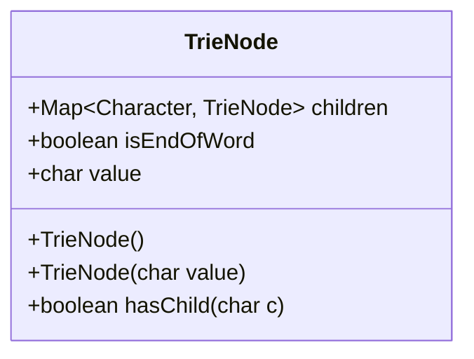
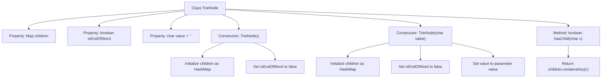

# Basic Information

|      |      |
|------|------|
| Name | TrieNode |
| Language | .java |
| Code Path | auto-suggest-java-demo/src/main/java/org/example/leansoftx/TrieNode.java |
| Package Name | org.example.leansoftx |
| Dependencies | ['java.util.HashMap', 'java.util.Map'] |
| Brief Description | The TrieNode class represents a trie node, containing a child node map, a word end flag, and a character value, providing construction methods and a way to check for the existence of child nodes. |

# Description

The content describes a class named TrieNode, which is used to implement a trie node structure. This class contains three member variables: children is a mapping from characters to child nodes, isEndOfWord marks whether it is the end of a word, and value stores the character value of the current node. Two constructors are provided: one initializes without parameters, and the other accepts a character parameter to set the value. It includes a hasChild method to check whether a child node with the specified character exists. All constructors initialize an empty child node mapping and a default word-end flag.

# Class Summary

| Name   | Type  | Description |
|-------|------|-------------|
| TrieNode | class | The TrieNode class represents a trie node, containing a child node map, an end-of-word flag, and a character value, providing constructor methods and methods to check for the existence of child nodes. |

## Class TrieNode

|      |      |
|------|------|
| Access Modifier | public |
| Type | class |
| Name | TrieNode |
| Description | The TrieNode class represents a trie node, containing a child node map, an end-of-word flag, and a character value, providing constructor methods and methods to check for the existence of child nodes. |

### UML Class Diagram

This code defines a TrieNode class used to implement the Trie data structure. The class contains three main members: a Map-type `children` for storing child nodes, a boolean-type `isEndOfWord` flag to mark the end of a word, and a char-type `value` to store the character value of the current node. The class provides two constructors (a default constructor and a character-parameterized constructor) as well as a `hasChild` method to check whether a child node with the specified character exists. This class serves as the foundational node structure for implementing a Trie, utilizing the `children` map to achieve a multi-way tree structure, making it suitable for scenarios such as string storage and prefix queries.

### Internal Method Call Graph

This code defines a TrieNode class for implementing the Trie data structure. The class contains three properties: a children map storing child nodes, isEndOfWord flag marking word endings, and value storing the current character. It provides two constructors: a default constructor and a character-parameterized constructor, both initializing empty child node maps. The hasChild method checks for the existence of a child node with the specified character. The flowchart clearly illustrates the class structure, construction process, and method invocation relationships.

### Field List

| Name  | Type  | Description |
|-------|-------|------|
| isEndOfWord | boolean | The boolean variable isEndOfWord indicates whether it is the end of a word. |
| children | Map<Character, TrieNode> | The class member variable `children`, of type `Map<Character, TrieNode>`, stores the mapping from characters to `TrieNode`. |
| value = ' ' | char | The variable "value" is of type char, with an initial value of a space. |

### Method List

| Name  | Type  | Description |
|-------|-------|------|
| hasChild | boolean | This method checks whether the character c is a child node of the current node and returns a boolean result. |

