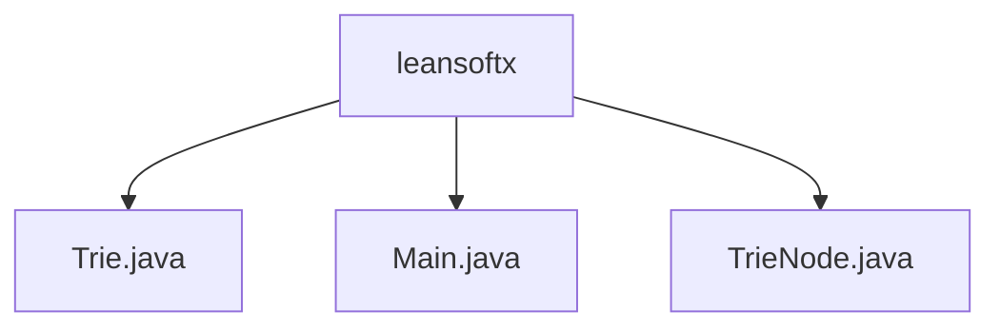

# Basic Information

|      |      |
|------|------|
| Name | leansoftx |
| Language | .java |
| Code Path | auto-suggest-java-demo/src/main/java/org/example/leansoftx |
| Package Name | docs.src.main.java.org.example.leansoftx |
| Brief Description | The dictionary tree implementation includes insertion, search, prefix completion, deletion, and spelling suggestion functionalities. The TrieNode class manages characters, child nodes, and word-end markers. The main program provides an interactive command-line interface supporting multiple operation modes, including Tab key completion and edit distance suggestions. |

# Description

## Overview  
This module implements a Trie-based intelligent dictionary system, with core responsibilities including efficient vocabulary storage, prefix-based auto-completion, and spelling suggestion functionalities. The interface specification covers standard Trie operations (insert/search/delete) and extended features (auto-completion/spelling suggestions), similar to the predictive text function in input methods. The key data structure is TrieNode, which contains a character value, a hash map of child nodes, and an end-of-word marker. External dependencies require only a basic Java environment. For example, spelling correction is achieved through edit distance algorithms, and the storage structure is visualized via tree printing.

## Key Business Scenarios  
The system supports interactive dictionary management, with a typical workflow as follows: during initialization, a preset vocabulary is loaded to construct the Trie tree, and users perform search/completion/deletion operations via the command line. The interactive mode includes Tab-triggered prefix completion (similar to IDE code hints) and Backspace-triggered input modifications. The complete functional chain includes: real-time candidate word matching when entering prefixes, recommending similar words for misspellings (e.g., suggesting "hello" for "helo"), and dynamically maintaining the Trie structure. API types encompass CRUD operations and query suggestions, with integrated use cases demonstrating the end-to-end process from tree construction to interactive retrieval.

### Package Internal Structure View

This flowchart illustrates the file structure within the org.example.leansoftx package of the auto-suggest-java-demo project. The root node is the leansoftx folder, which contains three Java source files: Trie.java implements the trie data structure, Main.java contains the program entry point, and TrieNode.java defines the trie node class. This represents a typical Java project package structure for core components implementing auto-completion functionality.

# File List

| Name   | Type  | Description |
|-------|------|-------------|
| [Trie.java](Trie.md) | file | Trie tree implementation supporting word insertion, prefix autocompletion, spelling suggestions (based on edit distance), and tree structure printing. Core operations include node traversal and recursive processing. |
| [Main.java](Main.md) | file | The Java class Main implements the trie functionality, including word search, prefix autocompletion, word deletion, and spelling suggestions. It initializes the trie and prints its structure, supporting user interaction operations. |
| [TrieNode.java](TrieNode.md) | file | The TrieNode class represents a trie node, containing a child node map, a word end flag, and a character value, providing a constructor method and a method to check for the existence of child nodes. |

