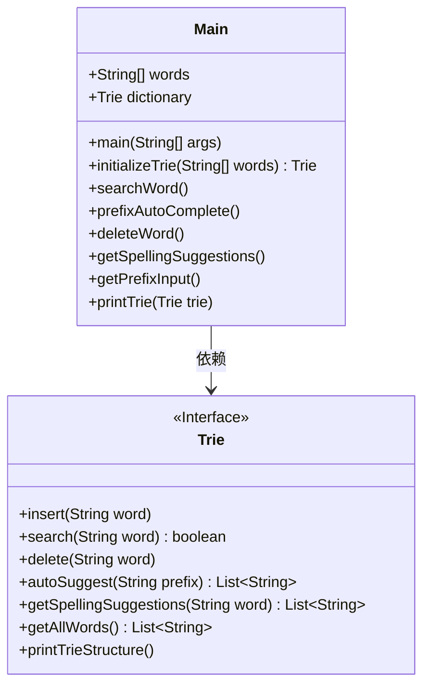
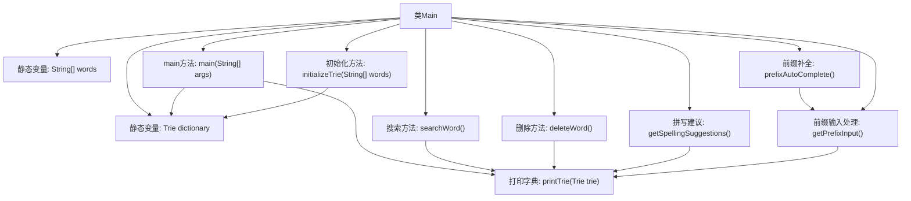

# 基础信息

|      |      |
|------|------|
| 名称 | Main |
| 编码语言 | .java |
| 代码路径 | auto-suggest-java-demo/src/main/java/org/example/leansoftx/Main.java |
| 包名 | org.example.leansoftx |
| 依赖项 | ['java.util.List', 'java.util.Scanner'] |
| 概述说明 | Java类Main实现字典树功能，包含单词搜索、前缀自动补全、删除单词和拼写建议。初始化字典树并打印结构，支持用户交互操作。 |

# 说明

该代码实现了一个基于Trie树的字典系统，包含单词插入、搜索、前缀自动补全、删除和拼写建议功能。初始化时加载预设单词数组并构建Trie树，主程序可打印字典结构。提供交互式命令行界面支持四种操作模式：搜索单词时显示存在性；前缀补全通过Tab键循环匹配结果；删除指定单词；获取拼写相似建议。核心类Trie未展示具体实现，但通过方法名可知其具备标准Trie操作和额外功能如自动建议。输入处理包含退格、空格等特殊字符的交互控制。

# 类列表 Class Summary

| 名称   | 类型  | 说明 |
|-------|------|-------------|
| Main | class | Java程序实现字典Trie树，支持插入、搜索、前缀补全、删除和拼写建议功能。 |

## 类 Main

|      |      |
|------|------|
| 访问范围 | public |
| 类型 | class |
| 名称 | Main |
| 说明 | Java程序实现字典Trie树，支持插入、搜索、前缀补全、删除和拼写建议功能。 |

### UML类图

这段代码展示了一个基于Trie树实现的字典系统。Main类作为入口点，包含字典初始化、单词搜索、前缀自动补全、单词删除和拼写建议等功能。Trie接口定义了字典的核心操作，包括插入、搜索、删除、自动建议和拼写建议等方法。Main类通过组合方式使用Trie接口，实现了完整的字典功能，包括交互式命令行操作和Trie结构可视化。

### 内部方法调用关系图

该流程图展示了Main类的核心结构和功能调用关系。类包含静态字典数据初始化、Trie结构打印和4个主要功能方法（搜索/前缀补全/删除/拼写建议），其中前缀补全功能通过getPrefixInput实现交互式输入处理。所有功能方法均依赖printTrie方法显示当前字典状态，初始化时通过initializeTrie构建Trie数据结构。箭头清晰反映了方法间的调用层级和数据流向。

### 字段列表 Field List

| 名称  | 类型  | 说明 |
|-------|-------|------|
| words = {            "as", "astronaut", "asteroid", "are", "around",            "cat", "cars", "cares", "careful", "carefully",            "for", "follows", "forgot", "from", "front",            "mellow", "mean", "money", "monday", "monster",            "place", "plan", "planet", "planets", "plans",            "the", "their", "they", "there", "towards"    } | String[] | 包含30个按字母分组的英文单词，涉及a、c、f、m、p、t开头的常见词汇。 |
| dictionary = initializeTrie(words) | Trie | 初始化字典Trie，静态变量存储单词集合。 |

### 方法列表

| 名称  | 类型  | 说明 |
|-------|-------|------|
| main | void | Java主函数调用字典打印Trie结构，其他功能被注释。 |
| prefixAutoComplete | void | 静态方法prefixAutoComplete展示字典树并获取前缀输入。 |
| deleteWord | void | 该方法用于从字典中删除单词。首先打印字典内容，然后循环提示用户输入要删除的单词。若输入为空则退出，否则检查单词是否存在并删除或提示未找到。最后关闭扫描器。 |
| getSpellingSuggestions | void | 该方法展示字典拼写建议功能：打印字典树，接收用户输入，返回并显示相似单词列表或无建议提示。 |
| getPrefixInput | void | Java方法实现前缀输入搜索功能，支持空格、退格、回车和Tab键循环搜索结果，异常处理包含在内。 |
| initializeTrie | Trie | 该方法初始化一个字典树，遍历输入字符串数组并将每个单词插入字典树，最后返回构建好的字典树。 |
| searchWord | void | 静态方法searchWord展示字典内容，循环提示用户输入单词搜索。输入空则退出，未找到单词时提示未找到信息。 |
| printTrie | void | 打印字典树中的所有单词，以逗号分隔。 |

