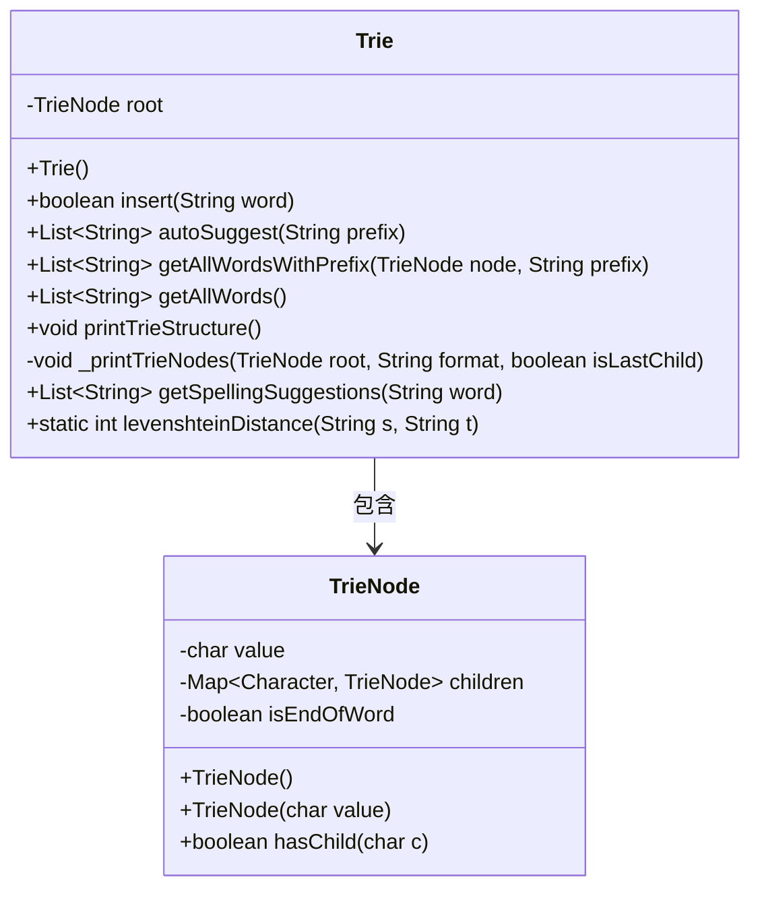
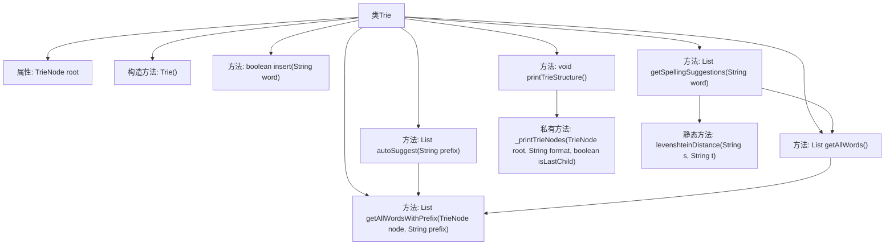

# 基础信息

|      |      |
|------|------|
| 名称 | Trie |
| 编码语言 | .java |
| 代码路径 | auto-suggest-java-demo/src/main/java/org/example/leansoftx/Trie.java |
| 包名 | org.example.leansoftx |
| 依赖项 | ['java.util'] |
| 概述说明 | Trie树实现，支持插入单词、前缀自动补全、拼写建议（基于编辑距离）及打印树结构功能。核心操作包括节点遍历和递归处理。 |

# 说明

该代码实现了一个字典树数据结构，包含插入单词、前缀自动补全、获取所有单词、打印树结构、拼写建议等功能。字典树通过TrieNode节点存储字符和子节点，使用哈希表管理子节点关系。插入方法会逐字符构建树路径并标记单词结束。自动补全功能通过前缀查找匹配单词。拼写建议基于编辑距离算法筛选相似单词。打印方法以树形结构可视化字典树。

# 类列表 Class Summary

| 名称   | 类型  | 说明 |
|-------|------|-------------|
| Trie | class | Trie类实现字典树，支持插入单词、前缀自动补全、获取所有单词、打印树结构和拼写建议功能，使用Levenshtein距离计算相似词。 |

## 类 Trie

|      |      |
|------|------|
| 访问范围 | public |
| 类型 | class |
| 名称 | Trie |
| 说明 | Trie类实现字典树，支持插入单词、前缀自动补全、获取所有单词、打印树结构和拼写建议功能，使用Levenshtein距离计算相似词。 |

### UML类图

这段代码实现了一个Trie（前缀树）数据结构，用于高效存储和检索字符串。Trie类包含插入单词、自动补全建议、获取所有单词、打印Trie结构、拼写建议等功能。TrieNode类表示树节点，存储字符值、子节点映射和单词结束标志。levenshteinDistance方法计算字符串编辑距离用于拼写建议。该结构特别适合字典实现和前缀搜索场景。

### 内部方法调用关系图

这段代码实现了一个Trie（前缀树）数据结构，用于高效存储和检索字符串。主要功能包括插入单词、自动补全建议、获取所有单词、打印Trie结构以及拼写建议。其中核心方法是insert()用于构建Trie树，autoSuggest()提供前缀匹配，getSpellingSuggestions()结合编辑距离算法实现拼写纠错。私有方法_printTrieNodes()以树形结构可视化Trie，静态方法levenshteinDistance()计算字符串相似度。整体设计体现了Trie在字符串处理中的高效性。

### 字段列表 Field List

| 名称  | 类型  | 说明 |
|-------|-------|------|
| root | TrieNode | 私有成员变量root，类型为TrieNode。 |

### 方法列表

| 名称  | 类型  | 说明 |
|-------|-------|------|
| printTrieStructure | void | 该方法用于打印Trie树结构，先输出根节点，然后递归打印所有子节点，使用缩进表示层级关系。 |
| getAllWords | List<String> | 获取所有单词列表，调用带前缀参数的方法从根节点开始遍历。 |
| getSpellingSuggestions | List<String> | 方法获取单词拼写建议：根据首字母前缀匹配所有词，计算与输入词的编辑距离（≤2），返回符合条件的建议列表。 |
| getAllWordsWithPrefix | List<String> | 方法getAllWordsWithPrefix接收TrieNode和前缀字符串，返回匹配前缀的单词列表，当前返回null需实现。 |
| insert | boolean | 该方法在字典树中插入单词。遍历每个字符，若无子节点则创建。若单词已存在返回false，否则标记为单词结尾并返回true。 |
| levenshteinDistance | int | 计算两个字符串的编辑距离，通过动态规划实现，返回最少操作次数。 |
| autoSuggest | List<String> | 方法autoSuggest接收前缀字符串，遍历字典树查找匹配节点，若无匹配返回空列表，否则返回该节点下所有以该前缀开头的单词。 |
| _printTrieNodes | void | 递归打印Trie树节点，按字母排序子节点，用符号表示层级关系。 |

