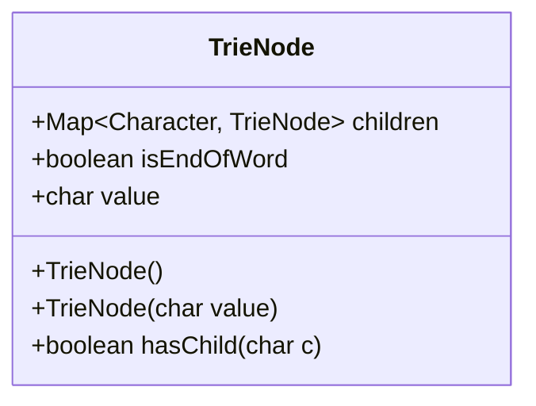
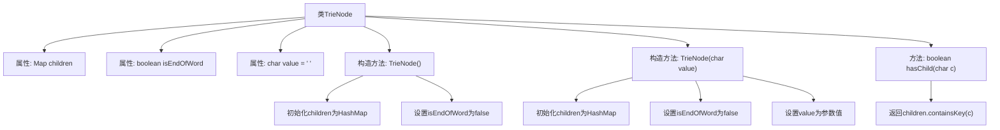

# 基础信息

|      |      |
|------|------|
| 名称 | TrieNode |
| 编码语言 | .java |
| 代码路径 | auto-suggest-java-demo/src/main/java/org/example/leansoftx/TrieNode.java |
| 包名 | org.example.leansoftx |
| 依赖项 | ['java.util.HashMap', 'java.util.Map'] |
| 概述说明 | TrieNode类表示字典树节点，包含子节点映射、单词结束标志和字符值，提供构造方法和检查子节点存在的方法。 |

# 说明

该内容描述了一个名为TrieNode的类，用于实现字典树节点结构。该类包含三个成员变量：children是一个字符到子节点的映射，isEndOfWord标记是否为单词结尾，value存储当前节点的字符值。提供了两个构造函数，一个无参初始化，另一个接受字符参数设置value。包含一个hasChild方法，用于检查是否存在指定字符的子节点。所有构造函数都会初始化空的子节点映射和默认的单词结束标志。

# 类列表 Class Summary

| 名称   | 类型  | 说明 |
|-------|------|-------------|
| TrieNode | class | TrieNode类表示字典树节点，包含子节点映射、是否单词结尾标志和字符值，提供构造方法和检查子节点存在的方法。 |

## 类 TrieNode

|      |      |
|------|------|
| 访问范围 | public |
| 类型 | class |
| 名称 | TrieNode |
| 说明 | TrieNode类表示字典树节点，包含子节点映射、是否单词结尾标志和字符值，提供构造方法和检查子节点存在的方法。 |

### UML类图

这段代码定义了一个TrieNode类，用于实现字典树（Trie）数据结构。该类包含三个主要成员：一个Map类型的children用于存储子节点，一个boolean类型的isEndOfWord标记单词结束，以及一个char类型的value存储当前节点的字符值。类提供了两个构造函数（默认构造函数和带字符参数的构造函数）以及一个hasChild方法用于检查是否存在指定字符的子节点。这个类是实现字典树的基础节点结构，通过children映射实现多叉树结构，适用于字符串存储和前缀查询等场景。

### 内部方法调用关系图

这段代码定义了一个TrieNode类，用于实现字典树(Trie)数据结构。类包含三个属性：children映射表存储子节点、isEndOfWord标记单词结束、value存储当前字符值。提供两个构造方法：默认构造和带字符参数的构造，都会初始化空的子节点映射表。hasChild方法用于检查是否存在指定字符的子节点。流程图清晰展示了类结构、构造过程和方法调用关系。

### 字段列表 Field List

| 名称  | 类型  | 说明 |
|-------|-------|------|
| isEndOfWord | boolean | 布尔变量isEndOfWord表示是否为单词结尾。 |
| children | Map<Character, TrieNode> | 类成员变量children，类型为Map<Character, TrieNode>，存储字符到TrieNode的映射。 |
| value = ' ' | char | 变量value为char类型，初始值为空格。 |

### 方法列表

| 名称  | 类型  | 说明 |
|-------|-------|------|
| hasChild | boolean | 该方法检查字符c是否为当前节点的子节点，返回布尔值结果。 |

