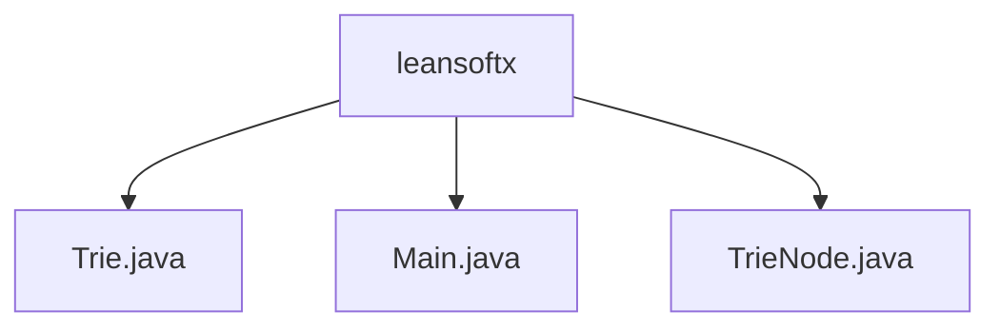

# 基础信息

|      |      |
|------|------|
| 名称 | leansoftx |
| 编码语言 | .java |
| 代码路径 | auto-suggest-java-demo/src/main/java/org/example/leansoftx |
| 包名 | docs.src.main.java.org.example.leansoftx |
| 概述说明 | 字典树实现包含插入、搜索、前缀补全、删除和拼写建议功能。TrieNode类管理字符、子节点和单词结束标记。主程序提供交互式命令行界面支持多种操作模式，包括Tab键补全和编辑距离建议。 |

# 说明

## 概述  
该模块实现了一个基于字典树(Trie)的智能词典系统，核心职责包括高效存储词汇、支持前缀自动补全和拼写建议功能。接口规范涵盖标准字典树操作（插入/搜索/删除）和扩展功能（自动补全/拼写建议），类似输入法的联想词功能。关键数据结构为TrieNode，包含字符值、子节点哈希映射和单词结束标志。外部依赖仅需基础Java环境。例如通过编辑距离算法实现拼写纠错，通过树形打印可视化存储结构。

## 主要业务场景  
系统支持交互式词典管理，典型流程为：初始化时加载预设词库构建Trie树，用户通过命令行进行搜索/补全/删除操作。交互模式包含Tab键触发前缀补全（类似IDE代码提示）、退格键修改输入等控制。完整功能链包括：输入前缀时实时匹配候选词、错误拼写时推荐相似词（如"helo"建议"hello"）、动态维护字典树结构。API类型涵盖CRUD操作和查询建议，集成案例展示从树构建到交互检索的全流程。

### 包内部结构视图

该流程图展示了auto-suggest-java-demo项目中org.example.leansoftx包下的文件结构。根节点为leansoftx文件夹，包含三个Java源文件：Trie.java实现字典树数据结构，Main.java包含程序入口点，TrieNode.java定义字典树节点类。这是一个典型的Java项目包结构，用于实现自动补全功能的核心组件。

# 文件列表

| 名称   | 类型  | 说明 |
|-------|------|-------------|
| [Trie.java](Trie.md) | file | Trie树实现，支持插入单词、前缀自动补全、拼写建议（基于编辑距离）及打印树结构功能。核心操作包括节点遍历和递归处理。 |
| [Main.java](Main.md) | file | Java类Main实现字典树功能，包含单词搜索、前缀自动补全、删除单词和拼写建议。初始化字典树并打印结构，支持用户交互操作。 |
| [TrieNode.java](TrieNode.md) | file | TrieNode类表示字典树节点，包含子节点映射、单词结束标志和字符值，提供构造方法和检查子节点存在的方法。 |

